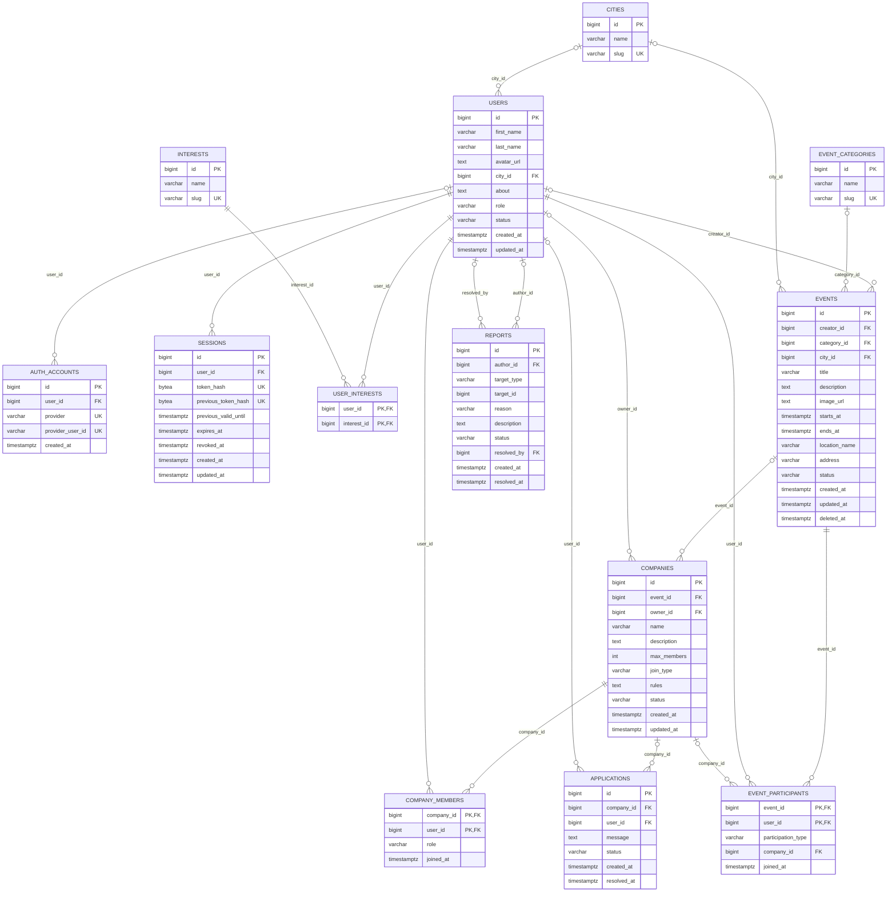

# ERD базы данных Poydem

Диаграмма ниже точно отражает схему после миграций
[`000001_initial_schema.up.sql`](../migrations/000001_initial_schema.up.sql) и
[`000002_refresh_sessions.up.sql`](../migrations/000002_refresh_sessions.up.sql),
ограничения событий дополнены миграцией
[`000003_events_hardening.up.sql`](../migrations/000003_events_hardening.up.sql),
а ограничения компаний и участия — миграцией
[`000004_companies_hardening.up.sql`](../migrations/000004_companies_hardening.up.sql).
Это 13 таблиц текущей базы.

`AUTH_ACCOUNTS(provider, provider_user_id)` имеет составное ограничение UNIQUE.
В ERD оба столбца отмечены `UK`, но уникальность действует на их пару.

`REPORTS(target_type, target_id)` — полиморфная ссылка на пользователя, событие
или компанию. Физического внешнего ключа для `target_id` нет; существование цели
проверяет приложение.

Текущие `CHECK` ограничивают:

- `events.status`: pending, active, rejected, blocked, completed;
- `companies.join_type`: open, request;
- `companies.status`: active, closed, blocked;
- `applications.status`: pending, approved, rejected, cancelled;
- `event_participants.participation_type`: solo, company;
- `reports.target_type`: user, company, event;
- `reports.status`: pending, resolved, rejected.

Начальная схема также создаёт девять индексов: события по городу/дате, категории
и статусу; компании по событию и владельцу; заявки по компании/статусу и
пользователю; участие по пользователю; жалобы по статусу. Индексы первичных и
уникальных ключей PostgreSQL создаёт автоматически.

Миграция `000003` делает ключевые ссылки, статус и timestamps события обязательными,
задаёт значения по умолчанию для статуса и timestamps, запрещает `ends_at <= starts_at`
и добавляет индексы публичного каталога и списка событий создателя.

Миграция `000004` добавляет `companies.deleted_at`, ограничивает `max_members`
значениями 2–100, фиксирует роли `owner/member`, делает ключевые поля компаний и
участия обязательными и запрещает участие типа `solo` с компанией либо типа
`company` без компании. Составной внешний ключ `(company_id, event_id)` не даёт
привязать участие к компании другого события.

Mermaid не показывает все признаки `NOT NULL` и значения по умолчанию. Для них
источником истины остаётся SQL-миграция, ссылка на которую приведена в начале.

## Дополнения целевой схемы MVP

Последующие миграции должны добавить:

- ограничения для `users.role` и `users.status`;
- частичный UNIQUE для одной pending-заявки на `(company_id, user_id)`;
- обязательность и значения по умолчанию для полей, которые заполняет приложение;
- индексы под сессии, личные списки и фоновые задачи.

`event_participants` уже имеет составной первичный ключ `(event_id, user_id)`,
поэтому отдельный UNIQUE для этой пары не нужен.

После добавления каждой миграции текущая ERD обновляется по фактической схеме.
